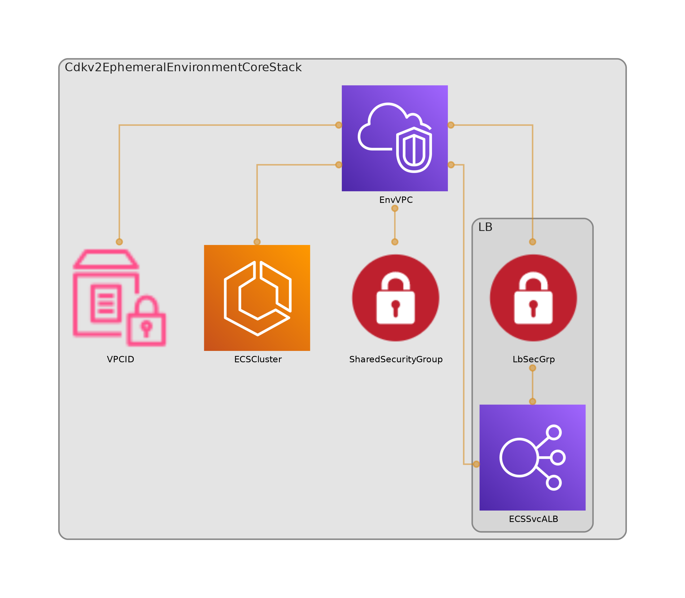

# Ephemeral environment Core

This is a demo project for CDK development with TypeScript.

The `cdk.json` file tells the CDK Toolkit how to execute your app.

# Code Diagram



# High level Architecture


# How to


1- Set environment vars or using aws cli profiles for deployment:

```bash
export CDK_DEPLOY_ACCOUNT='123456789012'
export CDK_DEPLOY_REGION='us-east-2'
```
2- Set properties in `environment-properties.json`

```json 

{
  "environment": {
    "name": "cdk-ecs-env-demo",
    "inputs": {
      "env": "dev",
      "vpc_cidr_block": "10.0.0.0/16",
      "nat_provider": "instance",
      "nat_gateways": 1,
      "ec2_capacity": false,
      "ec2_instance_type": "t3.medium",
      "allow_ecs_exec": true,
      "enhanced_cluster_monitoring": true,
      "service_discovery_namespace": "demo.svc",
      "load_balanced": true,
      "load_balanced_public": true
      
    }
  }
}

```

3- synth and deploy using CDK

## Useful commands

* `npm run build`   compile typescript to js
* `npm run watch`   watch for changes and compile
* `npm run test`    perform the jest unit tests
* `cdk deploy`      deploy this stack to your default AWS account/region
* `cdk diff`        compare deployed stack with current state
* `cdk synth`       emits the synthesized CloudFormation template
